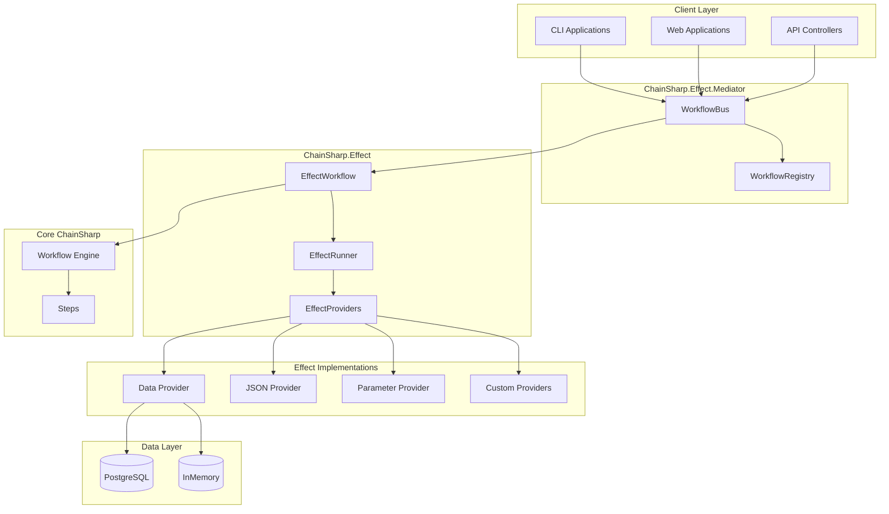
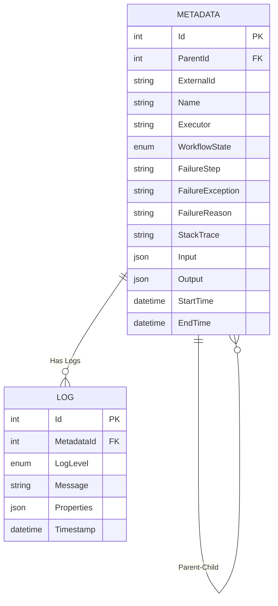
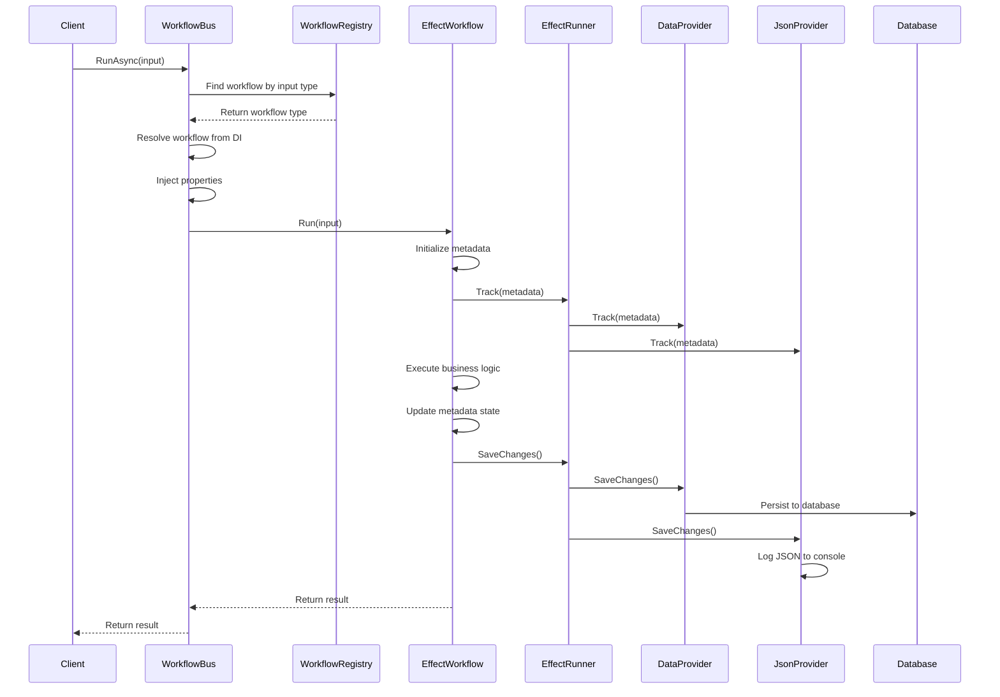
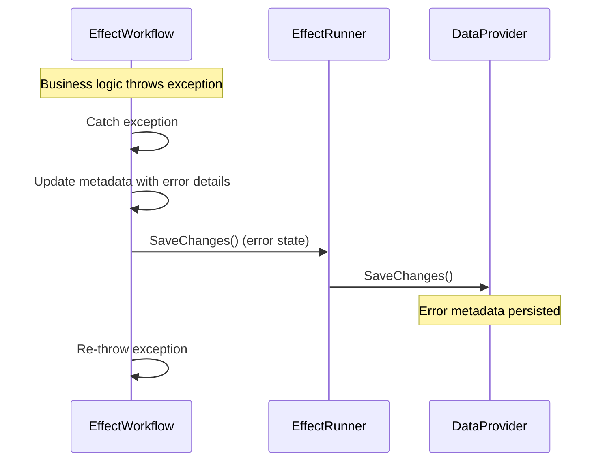

# ChainSharp System Components

## Detailed System Architecture and Component Relationships

This document provides comprehensive technical information about ChainSharp's components, their relationships, and how they work together to form a cohesive workflow engine.

## System Architecture Overview



## Core Component Hierarchy

### 1. ChainSharp (Core Engine)

The foundation layer providing Railway Oriented Programming patterns.

#### Key Classes
```csharp
// Base workflow class
public abstract class Workflow<TIn, TOut>
{
    public abstract Task<Either<Exception, TOut>> Run(TIn input);
    
    protected Chain<TIn> Activate(TIn input) => new Chain<TIn>(input);
}

// Step interface for individual operations
public interface IStep<TIn, TOut>
{
    Task<Either<Exception, TOut>> Run(TIn input);
}

// Chain class for composing steps
public class Chain<T>
{
    public Chain<TOut> Chain<TStep, TOut>() where TStep : IStep<T, TOut>;
    public Task<Either<Exception, T>> Resolve();
}
```

#### Responsibilities
- Define the Railway Oriented Programming pattern
- Provide step chaining mechanisms
- Handle error propagation through chains
- Core workflow lifecycle management

### 2. ChainSharp.Effect (Enhanced Workflows)

Extends core workflows with dependency injection, metadata tracking, and effect management.

#### Key Classes

##### EffectWorkflow<TIn, TOut>
```csharp
public abstract class EffectWorkflow<TIn, TOut> : Workflow<TIn, TOut>, IEffectWorkflow<TIn, TOut>
{
    [Inject] public IEffectRunner? EffectRunner { get; set; }
    [Inject] public ILogger<EffectWorkflow<TIn, TOut>>? EffectLogger { get; set; }
    [Inject] public IServiceProvider? ServiceProvider { get; set; }
    
    public Metadata Metadata { get; private set; }
    protected string WorkflowName => GetType().Name;
    protected int? ParentId { get; set; }
    
    public sealed override async Task<Either<Exception, TOut>> Run(TIn input)
    {
        // 1. Initialize metadata and start tracking
        Metadata = await InitializeWorkflow(input);
        
        try
        {
            // 2. Execute the actual workflow logic
            var result = await RunInternal(input);
            
            // 3. Finalize metadata and save effects
            await FinishWorkflow(result);
            await EffectRunner.SaveChanges(CancellationToken.None);
            
            return result;
        }
        catch (Exception ex)
        {
            // 4. Handle failures and save error state
            await FinishWorkflow(Either<Exception, TOut>.Left(ex));
            await EffectRunner.SaveChanges(CancellationToken.None);
            throw;
        }
    }
    
    protected abstract Task<Either<Exception, TOut>> RunInternal(TIn input);
}
```

##### EffectRunner
```csharp
public class EffectRunner : IEffectRunner
{
    private List<IEffectProvider> ActiveEffectProviders { get; init; }

    public EffectRunner(IEnumerable<IEffectProviderFactory> effectProviderFactories)
    {
        ActiveEffectProviders = [];
        ActiveEffectProviders.AddRange(
            effectProviderFactories.RunAll(factory => factory.Create())
        );
    }

    public async Task Track(IModel model)
    {
        ActiveEffectProviders.RunAll(provider => provider.Track(model));
    }

    public async Task SaveChanges(CancellationToken cancellationToken)
    {
        await ActiveEffectProviders.RunAllAsync(
            provider => provider.SaveChanges(cancellationToken)
        );
    }

    public void Dispose() => DeactivateProviders();
}
```

#### Responsibilities
- Extend base workflows with effect tracking
- Manage dependency injection through [Inject] attributes
- Handle metadata lifecycle (creation, tracking, persistence)
- Coordinate effect providers through EffectRunner
- Provide error handling and logging integration

### 3. Effect Providers Architecture

Effect providers implement the `IEffectProvider` interface to handle different concerns.

#### IEffectProvider Interface
```csharp
public interface IEffectProvider : IDisposable
{
    Task SaveChanges(CancellationToken cancellationToken);
    Task Track(IModel model);
}
```

#### Available Effect Providers

| Provider | Package | Purpose | Performance Impact |
|----------|---------|---------|-------------------|
| **DataContext** | ChainSharp.Effect.Data | Database persistence | Medium - Database I/O |
| **JsonEffect** | ChainSharp.Effect.Provider.Json | Debug logging | Low - JSON serialization |
| **ParameterEffect** | ChainSharp.Effect.Provider.Parameter | Parameter serialization | Medium - JSON + Storage |
| **Custom Providers** | User-defined | Application-specific | Varies |

## 4. ChainSharp.Effect.Data (Persistence Layer)

### Architecture Components

#### DataContext<TDbContext>
```csharp
public class DataContext<TDbContext> : DbContext, IDataContext
    where TDbContext : DbContext
{
    public DbSet<Metadata> Metadatas { get; set; }
    public DbSet<Log> Logs { get; set; }
    
    // IEffectProvider implementation
    public async Task SaveChanges(CancellationToken cancellationToken)
    {
        await base.SaveChangesAsync(cancellationToken);
    }

    public async Task Track(IModel model)
    {
        Add(model);
    }
    
    // Transaction support
    public async Task<IDataContextTransaction> BeginTransaction() { }
    public async Task CommitTransaction() { }
    public async Task RollbackTransaction() { }
}
```

#### Data Model Structure


### Implementation Variants

#### PostgreSQL Implementation
```csharp
public class PostgresContext : DataContext<PostgresContext>
{
    protected override void OnModelCreating(ModelBuilder modelBuilder)
    {
        base.OnModelCreating(modelBuilder);
        
        modelBuilder
            .HasDefaultSchema("chain_sharp")
            .AddPostgresEnums()                    // PostgreSQL enum types
            .ApplyUtcDateTimeConverter();          // UTC date handling
    }
}
```

**Features:**
- Production-ready with ACID transactions
- JSON column support for input/output parameters
- Automatic schema migration
- PostgreSQL-specific optimizations (enums, JSON queries)

#### InMemory Implementation
```csharp
public class InMemoryContext : DataContext<InMemoryContext>
{
    // Minimal implementation - inherits all functionality
    // Uses Entity Framework Core's in-memory provider
}
```

**Features:**
- Fast, lightweight for testing
- No external dependencies
- Automatic cleanup between tests
- API-compatible with production database

## 5. ChainSharp.Effect.Mediator (Discovery & Routing)

### Component Architecture

#### WorkflowRegistry
```csharp
public class WorkflowRegistry : IWorkflowRegistry
{
    public Dictionary<Type, Type> InputTypeToWorkflow { get; set; }

    public WorkflowRegistry(params Assembly[] assemblies)
    {
        // Scan assemblies for workflow implementations
        var workflowType = typeof(IEffectWorkflow<,>);
        var allWorkflowTypes = ScanAssembliesForWorkflows(assemblies, workflowType);
        
        // Create mapping: InputType -> WorkflowType
        InputTypeToWorkflow = allWorkflowTypes.ToDictionary(
            workflowType => ExtractInputType(workflowType),
            workflowType => workflowType
        );
    }
}
```

#### WorkflowBus
```csharp
public class WorkflowBus : IWorkflowBus
{
    public async Task<TOut> RunAsync<TOut>(object workflowInput, Metadata? parentMetadata = null)
    {
        // 1. Find workflow type by input type
        var inputType = workflowInput.GetType();
        var workflowType = _registryService.InputTypeToWorkflow[inputType];
        
        // 2. Resolve workflow from DI container
        var workflow = _serviceProvider.GetRequiredService(workflowType);
        
        // 3. Inject properties with [Inject] attribute
        _serviceProvider.InjectProperties(workflow);
        
        // 4. Set up parent-child relationship if needed
        if (parentMetadata != null)
            SetParentId(workflow, parentMetadata.Id);
        
        // 5. Execute workflow using reflection
        return await InvokeWorkflowRun<TOut>(workflow, workflowInput);
    }
}
```

### Key Constraints and Design Decisions

#### Input Type Uniqueness Constraint
**Critical:** Each input type can only map to ONE workflow.

```csharp
// ❌ This will cause conflicts
public class CreateUserWorkflow : EffectWorkflow<UserRequest, User> { }
public class UpdateUserWorkflow : EffectWorkflow<UserRequest, User> { }

// ✅ This works correctly  
public class CreateUserWorkflow : EffectWorkflow<CreateUserRequest, User> { }
public class UpdateUserWorkflow : EffectWorkflow<UpdateUserRequest, User> { }
```

#### Workflow Discovery Rules
1. **Must be concrete classes** (not abstract)
2. **Must implement IEffectWorkflow<,>**
3. **Must have parameterless constructor or be registered in DI**
4. **Should implement a non-generic interface** for better DI integration

## 6. Specialized Effect Providers

### ChainSharp.Effect.Provider.Json (Debug Logging)

```csharp
public class JsonEffectProvider : IJsonEffectProvider
{
    private readonly Dictionary<IModel, string> _previousStates = new();
    private readonly HashSet<IModel> _trackedModels = [];

    public async Task Track(IModel model)
    {
        if (_trackedModels.Add(model))
        {
            // Store initial serialized state
            _previousStates[model] = JsonSerializer.Serialize(model, _options);
        }
    }

    public async Task SaveChanges(CancellationToken cancellationToken)
    {
        foreach (var model in _trackedModels)
        {
            var currentState = JsonSerializer.Serialize(model, _options);
            
            // Only log if state changed
            if (_previousStates[model] != currentState)
            {
                _logger.LogInformation(currentState);
                _previousStates[model] = currentState;
            }
        }
    }
}
```

**Use Cases:**
- Development debugging
- Workflow state inspection
- Change tracking without persistence
- Integration test verification

### ChainSharp.Effect.Provider.Parameter (Parameter Serialization)

```csharp
public class ParameterEffect : IEffectProvider
{
    private readonly HashSet<Metadata> _trackedMetadatas = [];

    public async Task Track(IModel model)
    {
        if (model is Metadata metadata)
        {
            _trackedMetadatas.Add(metadata);
            SerializeParameters(metadata);
        }
    }

    private void SerializeParameters(Metadata metadata)
    {
        // Serialize dynamic objects to JSON for database storage
        if (metadata.InputObject is not null)
        {
            var json = JsonSerializer.Serialize(metadata.InputObject, _options);
            metadata.Input = JsonDocument.Parse(json);
        }

        if (metadata.OutputObject is not null)
        {
            var json = JsonSerializer.Serialize(metadata.OutputObject, _options);
            metadata.Output = JsonDocument.Parse(json);
        }
    }
}
```

**Benefits:**
- Query workflow history by parameter values
- Audit trail of all inputs and outputs
- Analytics and reporting capabilities

**Performance Considerations:**
- JSON serialization overhead
- Increased database storage requirements
- Potential memory pressure with large objects

## 7. Service Registration and Configuration

### Registration Patterns

#### Basic Effect Registration
```csharp
public static class ServiceExtensions
{
    public static ChainSharpEffectConfigurationBuilder AddChainSharpEffects(
        this IServiceCollection services,
        Action<ChainSharpEffectConfigurationBuilder> configure)
    {
        var builder = new ChainSharpEffectConfigurationBuilder(services);
        configure(builder);
        return builder;
    }
}
```

#### Effect Provider Registration
```csharp
public static ChainSharpEffectConfigurationBuilder AddEffect<TFactory>(
    this ChainSharpEffectConfigurationBuilder builder)
    where TFactory : class, IEffectProviderFactory
{
    builder.ServiceCollection.AddTransient<IEffectProviderFactory, TFactory>();
    return builder;
}
```

#### Workflow Registration
```csharp
public static IServiceCollection RegisterEffectWorkflows(
    this IServiceCollection services,
    ServiceLifetime serviceLifetime = ServiceLifetime.Transient,
    params Assembly[] assemblies)
{
    // Auto-discover and register all workflows
    var workflows = ScanForWorkflows(assemblies);
    foreach (var (interfaceType, implementationType) in workflows)
    {
        RegisterWorkflowWithLifetime(services, interfaceType, implementationType, serviceLifetime);
    }
    return services;
}
```

### Configuration Examples

#### Development Configuration
```csharp
services.AddChainSharpEffects(options => 
    options
        .AddInMemoryEffect()                           // Fast, temporary storage
        .AddJsonEffect()                               // Debug logging
        .AddEffectWorkflowBus(typeof(Program).Assembly) // Auto-discovery
);
```

#### Production Configuration
```csharp
services.AddChainSharpEffects(options => 
    options
        .AddPostgresEffect(connectionString)           // Persistent storage
        .SaveWorkflowParameters()                      // Parameter tracking
        .AddEffectWorkflowBus(                        // Controlled discovery
            typeof(OrderWorkflow).Assembly,
            typeof(UserWorkflow).Assembly
        )
);
```

## Component Integration Flow

### Complete Workflow Execution Flow



### Error Handling Flow



## Performance and Scalability Considerations

### Component Performance Characteristics

| Component | Overhead | Scaling Factor |
|-----------|----------|----------------|
| **Core ChainSharp** | Minimal | Linear with step count |
| **EffectWorkflow** | Low | Linear with effect count |
| **DataContext** | Medium | Database performance dependent |
| **JsonEffect** | Low | Linear with object complexity |
| **ParameterEffect** | Medium | Exponential with object size |
| **WorkflowBus** | Very Low | Constant (cached lookup) |

### Optimization Strategies

1. **Effect Provider Selection**
   - Use only necessary effects in production
   - Disable JsonEffect and ParameterEffect for high-performance scenarios

2. **Database Optimization**
   - Use appropriate connection pooling
   - Optimize JSON column indexes
   - Consider archiving old metadata

3. **Memory Management**
   - Use Transient lifetimes for workflows
   - Implement proper disposal patterns
   - Monitor for memory leaks in effect providers

This component architecture provides a flexible, extensible foundation for building complex workflow systems while maintaining clear separation of concerns and comprehensive observability.
