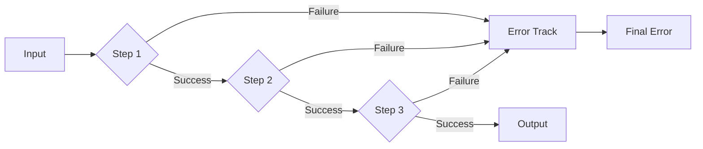
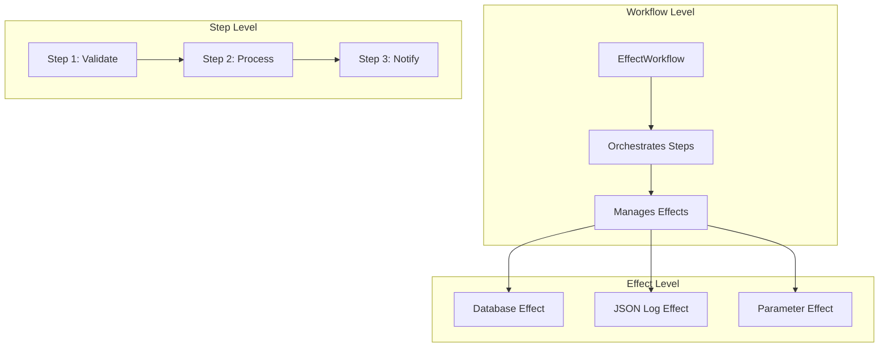
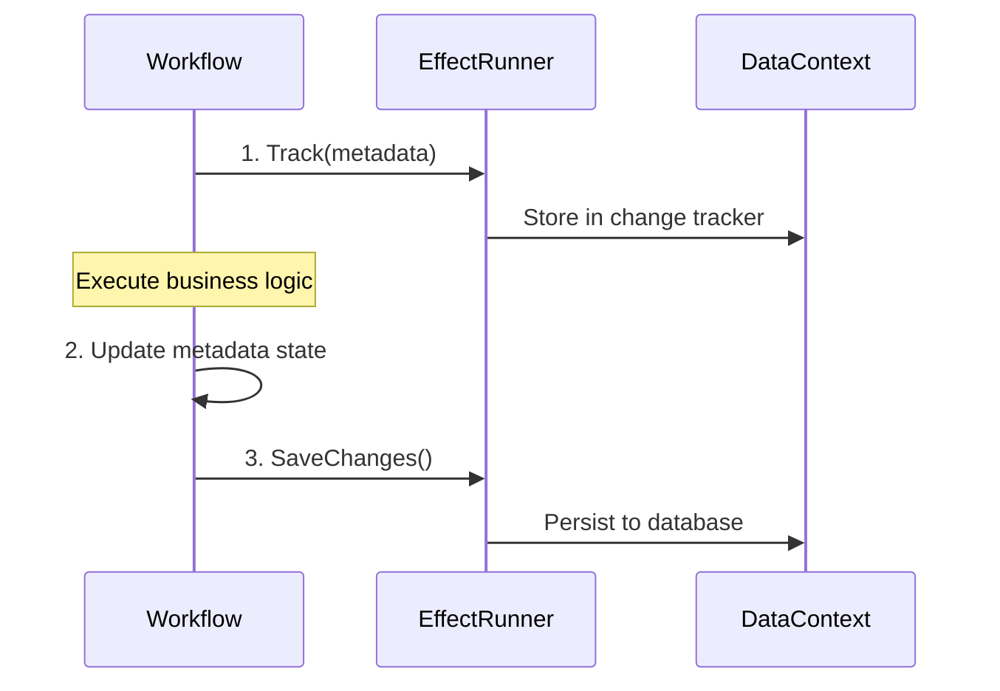
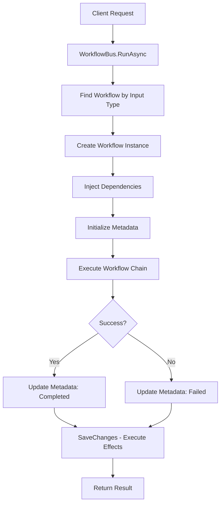

# ChainSharp Core Concepts

## Essential Knowledge for Understanding ChainSharp

This document explains the fundamental concepts that power ChainSharp. Understanding these concepts is crucial for working with any part of the system.

## 1. Railway Oriented Programming (ROP)

### What is Railway Oriented Programming?

Railway Oriented Programming is a functional programming pattern that treats operations like a train on railway tracks:

- **Success Track**: Operations continue flowing forward when successful
- **Failure Track**: Operations jump to the failure track when errors occur
- **No Manual Error Checking**: The "railway" automatically routes success/failure



### Railway Pattern in C#

ChainSharp uses the `Either<Exception, T>` type to represent railway tracks:

```csharp
public class Either<TLeft, TRight>
{
    // Contains either an error (TLeft) or success value (TRight)
    public bool IsLeft { get; }     // Error occurred
    public bool IsRight { get; }    // Success occurred
}

// Usage in workflows:
public async Task<Either<Exception, User>> CreateUser(CreateUserRequest input)
{
    return Activate(input)
        .Chain<ValidateUserStep>()    // If this fails, skip remaining steps
        .Chain<CreateUserStep>()      // Only runs if validation succeeded
        .Chain<SendEmailStep>()       // Only runs if creation succeeded
        .Resolve();                   // Return Either<Exception, User>
}
```

### Benefits of Railway Pattern

1. **No Forgotten Error Handling**: Errors automatically propagate
2. **Clean Success Path**: Focus on happy path without try/catch blocks
3. **Composable Operations**: Chain operations without nested error checking
4. **Type Safety**: Compiler ensures you handle both success and failure cases

## 2. Effect Pattern

### What is the Effect Pattern?

The Effect Pattern separates **describing what to do** from **actually doing it**:

- **Track Phase**: Record what effects need to happen
- **Execute Phase**: Run all tracked effects atomically

This is similar to how Entity Framework's DbContext works:
```csharp
// Track changes (doesn't hit database yet)
context.Users.Add(user);
context.Orders.Update(order);

// Execute all changes atomically
await context.SaveChanges();
```

### Effect Pattern in ChainSharp

```csharp
public class CreateUserWorkflow : EffectWorkflow<CreateUserRequest, User>
{
    protected override async Task<Either<Exception, User>> RunInternal(CreateUserRequest input)
    {
        // 1. Create metadata (tracked, not saved yet)
        var metadata = Metadata.Create(new CreateMetadata { Name = "CreateUser", Input = input });
        
        // 2. Execute business logic
        var result = Activate(input)
            .Chain<ValidateUserStep>()
            .Chain<CreateUserStep>()
            .Resolve();
            
        // 3. All tracked effects are saved automatically when workflow completes
        return result;
    }
}
```

### Why Use the Effect Pattern?

1. **Consistency**: All effects succeed or fail together
2. **Performance**: Batch operations instead of individual database calls
3. **Testability**: Can verify what effects would happen without executing them
4. **Debugging**: See exactly what will happen before it happens

## 3. Core Components Explained

### Workflows vs Steps vs Effects



#### Workflows
- **Purpose**: Orchestrate business processes
- **Responsibility**: Chain steps together, handle dependencies
- **Example**: CreateUserWorkflow, ProcessOrderWorkflow

#### Steps  
- **Purpose**: Perform specific operations
- **Responsibility**: Single, focused task
- **Example**: ValidateEmailStep, SendNotificationStep

#### Effects
- **Purpose**: Handle cross-cutting concerns
- **Responsibility**: Persistence, logging, notifications
- **Example**: Database persistence, JSON logging, parameter serialization

### The EffectRunner

The EffectRunner coordinates all effects in a workflow:

```csharp
public class EffectRunner : IEffectRunner
{
    private List<IEffectProvider> ActiveEffectProviders { get; }

    public async Task Track(IModel model)
    {
        // Send model to all effect providers
        foreach (var provider in ActiveEffectProviders)
        {
            await provider.Track(model);
        }
    }

    public async Task SaveChanges(CancellationToken cancellationToken)
    {
        // Execute all tracked effects atomically
        foreach (var provider in ActiveEffectProviders)
        {
            await provider.SaveChanges(cancellationToken);
        }
    }
}
```

## 4. Dependency Injection with [Inject]

### Traditional Constructor Injection
```csharp
// Traditional approach - verbose constructors
public class CreateUserWorkflow(
    IUserRepository userRepository,
    IEmailService emailService,
    ILogger<CreateUserWorkflow> logger
) : EffectWorkflow<CreateUserRequest, User>
{
    private readonly IUserRepository _userRepository = userRepository;
    // ... more boilerplate
}
```

### ChainSharp Attribute Injection
```csharp
// ChainSharp approach - clean and focused
public class CreateUserWorkflow : EffectWorkflow<CreateUserRequest, User>
{
    [Inject]
    public IUserRepository UserRepository { get; set; }
    
    [Inject]
    public IEmailService EmailService { get; set; }
    
    [Inject]
    public ILogger<CreateUserWorkflow> Logger { get; set; }
    
    // Focus on business logic, not plumbing
    protected override async Task<Either<Exception, User>> RunInternal(CreateUserRequest input)
        => Activate(input)
            .Chain<ValidateUserStep>()
            .Chain<CreateUserStep>()
            .Resolve();
}
```

### How [Inject] Works

1. **Property Discovery**: System finds all properties with `[Inject]` attribute
2. **Service Resolution**: Resolve services from dependency injection container
3. **Property Setting**: Set property values before workflow execution
4. **Automatic Lifecycle**: Happens automatically when workflow is created

### Automatic Injection for Built-in Services

EffectWorkflow automatically injects these services:
```csharp
[Inject]
public IEffectRunner? EffectRunner { get; set; }

[Inject]
public ILogger<EffectWorkflow<TIn, TOut>>? EffectLogger { get; set; }

[Inject]
public IServiceProvider? ServiceProvider { get; set; }
```

## 5. Metadata Tracking and Lifecycle

### What is Metadata?

Metadata is a record of workflow execution containing:

```csharp
public class Metadata : IMetadata
{
    public int Id { get; }                          // Unique identifier
    public string Name { get; set; }                // Workflow name
    public WorkflowState WorkflowState { get; set; } // Pending/InProgress/Completed/Failed
    public DateTime StartTime { get; set; }         // When workflow started
    public DateTime? EndTime { get; set; }          // When workflow finished
    public JsonDocument? Input { get; set; }        // Serialized input
    public JsonDocument? Output { get; set; }       // Serialized output
    public string? FailureException { get; }        // Error details if failed
    public string? FailureReason { get; }           // Human-readable error
    public int? ParentId { get; set; }              // For nested workflows
}
```

### Metadata Lifecycle



### Metadata States

| State | Meaning | When Set |
|-------|---------|----------|
| **Pending** | Workflow created but not started | Metadata.Create() |
| **InProgress** | Workflow is executing | Workflow.Run() starts |
| **Completed** | Workflow finished successfully | Workflow.Run() succeeds |
| **Failed** | Workflow encountered an error | Workflow.Run() fails |

### Parent-Child Relationships

Workflows can spawn child workflows:
```csharp
public class ParentWorkflow : EffectWorkflow<ParentRequest, ParentResult>
{
    [Inject]
    public IWorkflowBus WorkflowBus { get; set; }
    
    protected override async Task<Either<Exception, ParentResult>> RunInternal(ParentRequest input)
    {
        // Pass current metadata as parent for child workflow
        var childResult = await WorkflowBus.RunAsync<ChildResult>(
            new ChildRequest(), 
            Metadata  // This creates parent-child relationship
        );
        
        return new ParentResult { ChildData = childResult };
    }
}
```

## 6. Key Terminology Glossary

### Core Terms

| Term | Definition |
|------|------------|
| **Railway Oriented Programming** | Pattern where operations flow on success/failure tracks |
| **Effect** | A deferred operation that will be executed later |
| **EffectProvider** | Component that implements a specific type of effect |
| **EffectRunner** | Coordinator that manages all effect providers |
| **EffectWorkflow** | Workflow enhanced with effect tracking and dependency injection |

### Component Terms

| Term | Definition |
|------|------------|
| **Step** | Single operation in a workflow chain |
| **Chain** | Sequence of steps executed in order |
| **Activate** | Start a workflow chain with initial input |
| **Resolve** | Execute the chain and return the result |
| **Track** | Record an effect without executing it |
| **SaveChanges** | Execute all tracked effects atomically |

### Data Terms

| Term | Definition |
|------|------------|
| **Metadata** | Record of workflow execution details |
| **DataContext** | Database context that implements IEffectProvider |
| **JsonDocument** | Immutable representation of JSON data |
| **WorkflowState** | Current state of workflow execution |
| **ParentId** | Reference to parent workflow for nested workflows |

### Mediator Terms

| Term | Definition |
|------|------------|
| **WorkflowBus** | Service that routes inputs to appropriate workflows |
| **WorkflowRegistry** | Mapping of input types to workflow types |
| **Auto-Discovery** | Automatic finding and registration of workflows |
| **Input-Based Routing** | Determining workflow by the type of input |

## Understanding ChainSharp Flow



This flow shows how all the concepts work together:
1. **Railway Pattern**: Each step can succeed or fail
2. **Effect Pattern**: Metadata tracked but not saved until end
3. **Dependency Injection**: Services automatically injected
4. **Metadata Lifecycle**: Tracked from start to finish

These concepts form the foundation of ChainSharp. Understanding them will help you work effectively with any part of the system.
