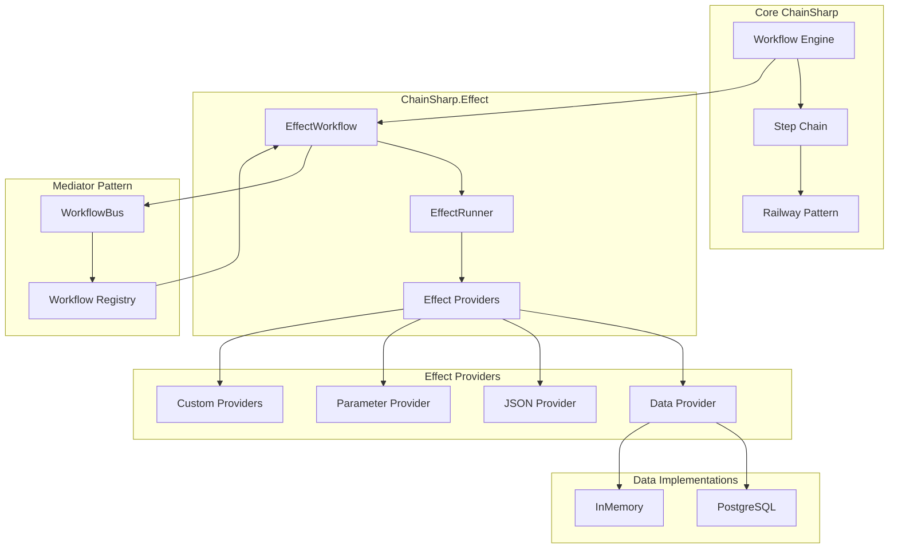

# ChainSharp System Overview

## What is ChainSharp?

ChainSharp is a .NET workflow engine that implements Railway Oriented Programming (ROP) with an advanced Effect Pattern for building robust, maintainable business processes. It provides a structured approach to handling complex operations while maintaining clean separation of concerns and comprehensive error handling.

## Core Value Propositions

### 1. Railway Oriented Programming
- **Fail-Fast Design**: Operations either succeed or fail, with automatic error propagation
- **Composable Steps**: Chain operations together with automatic error handling
- **Type Safety**: Strongly typed inputs and outputs with compile-time guarantees

### 2. Effect Pattern
- **Deferred Execution**: Track operations without immediate execution
- **Unit of Work**: Batch operations and execute them atomically
- **Extensible Providers**: Pluggable effects for different concerns (database, logging, etc.)

### 3. Automatic Dependency Injection
- **Attribute-Based**: Use `[Inject]` attribute instead of constructor injection
- **Workflow Discovery**: Automatically find and register workflows based on input types
- **Service Integration**: Seamless integration with .NET dependency injection

## System Architecture



## Key Components

| Component | Purpose | When to Use |
|-----------|---------|-------------|
| **ChainSharp** | Core workflow engine with Railway pattern | All workflow scenarios |
| **ChainSharp.Effect** | Enhanced workflows with dependency injection and metadata | When you need DI, tracking, or effects |
| **ChainSharp.Effect.Data** | Database persistence for workflow metadata | Production systems requiring audit trails |
| **ChainSharp.Effect.Provider.Json** | JSON logging of models for debugging | Development and troubleshooting |
| **ChainSharp.Effect.Mediator** | Automatic workflow discovery and routing | Applications with many workflows |
| **ChainSharp.Effect.Provider.Parameter** | Serialize workflow inputs/outputs to database | When you need to persist and query parameters |

## Quick Start Example

### 1. Basic Workflow
```csharp
public class CreateUserWorkflow : EffectWorkflow<CreateUserRequest, User>
{
    [Inject]
    public IUserRepository UserRepository { get; set; }
    
    [Inject]
    public IEmailService EmailService { get; set; }
    
    protected override async Task<Either<Exception, User>> RunInternal(CreateUserRequest input)
        => Activate(input)
            .Chain<ValidateUserStep>()
            .Chain<CreateUserStep>()
            .Chain<SendWelcomeEmailStep>()
            .Resolve();
}
```

### 2. Service Registration
```csharp
// Program.cs
services.AddChainSharpEffects(options => 
    options
        .AddPostgresEffect(connectionString)        // Database persistence
        .SaveWorkflowParameters()                   // Save inputs/outputs
        .AddEffectWorkflowBus(typeof(Program).Assembly) // Auto-discovery
);
```

### 3. Workflow Execution
```csharp
// Controller or service
public class UserController(IWorkflowBus workflowBus) : ControllerBase
{
    [HttpPost]
    public async Task<User> CreateUser(CreateUserRequest request)
        => await workflowBus.RunAsync<User>(request);
}
```

## When to Choose ChainSharp

### ✅ Ideal For:
- **Complex Business Processes**: Multi-step operations with branching logic
- **Error-Prone Operations**: External API calls, database operations, file processing
- **Audit Requirements**: Need to track what happened, when, and why
- **Microservices**: Coordinating operations across service boundaries
- **Event-Driven Architecture**: Processing events with multiple side effects

### ❌ Consider Alternatives For:
- **Simple CRUD Operations**: Basic database read/write operations
- **High-Frequency, Low-Latency**: Real-time systems where every millisecond counts
- **Stateless Functions**: Pure computational tasks without side effects
- **Legacy Integration**: Systems that can't adopt modern .NET patterns

## Development Environment Quick Setup

ChainSharp uses a devcontainer for consistent development environments:

1. **Prerequisites**: Docker + VS Code with Remote-Containers extension
2. **Clone and Open**: `git clone repo && code .`
3. **Reopen in Container**: VS Code will prompt automatically
4. **Ready to Code**: PostgreSQL database and .NET SDK pre-configured

## Effect Pattern in 30 Seconds

```csharp
// 1. Create workflow - metadata is tracked but not saved
var workflow = new CreateUserWorkflow();

// 2. Execute steps - effects are tracked but not executed
var result = await workflow.Run(input);

// 3. Save changes - all tracked effects execute atomically
await effectRunner.SaveChanges();
```

This pattern ensures:
- **Consistency**: All effects succeed or fail together
- **Performance**: Batch operations instead of individual saves
- **Debugging**: See exactly what will happen before it happens

## Common Usage Patterns

### Pattern 1: Database + Audit Trail
```csharp
services.AddChainSharpEffects(options => 
    options
        .AddPostgresEffect(connectionString)
        .SaveWorkflowParameters()
);
```

### Pattern 2: Development with JSON Logging
```csharp
services.AddChainSharpEffects(options => 
    options
        .AddInMemoryEffect()
        .AddJsonEffect()
);
```

### Pattern 3: Production with Mediator
```csharp
services.AddChainSharpEffects(options => 
    options
        .AddPostgresEffect(connectionString)
        .AddEffectWorkflowBus(assemblies)
);
```

## Next Steps

- **Learn Core Concepts**: Read [CONCEPTS.md](./CONCEPTS.md) for essential knowledge
- **Understand Architecture**: See [COMPONENTS.md](./COMPONENTS.md) for detailed technical information
- **Implement Solutions**: Follow [USAGE-GUIDE.md](./USAGE-GUIDE.md) for practical examples
- **Solve Problems**: Check [TROUBLESHOOTING.md](./TROUBLESHOOTING.md) when issues arise
- **Set Up Development**: Use [DEVELOPMENT.md](./DEVELOPMENT.md) for environment setup

## Key Design Principles

1. **Fail Fast**: Errors are caught early and propagated clearly
2. **Composability**: Small, focused steps combine into complex workflows
3. **Separation of Concerns**: Business logic, persistence, and infrastructure are separate
4. **Testability**: Each component can be tested in isolation
5. **Performance**: Effects are batched and optimized for efficiency
6. **Observability**: Comprehensive metadata tracking and logging

ChainSharp transforms complex business processes into maintainable, testable, and observable code while providing the reliability and error handling your production systems need.
